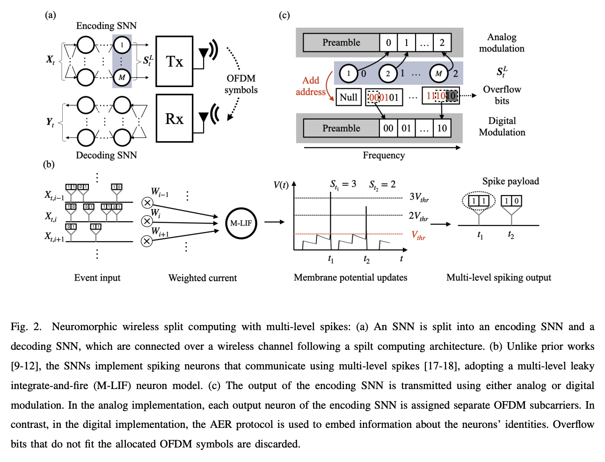

# NeuroComm-MSNN

## Neuromorphic Wireless Split Computing with Multi-Level Spikes

<p align="center">

</p>

This repository implements Neuromorphic Wireless Split Computing using Multi-Level Spikes. The code is based on [SNNCutoff](https://dengyu-wu.github.io/snncutoff/).

---

## Dataset Preprocessing: DVS128 Gesture

1. Download the dataset from [Dropbox](https://ibm.ent.box.com/s/3hiq58ww1pbbjrinh367ykfdf60xsfm8).
2. Use the provided preprocessing code to prepare the dataset for training.

---

## Getting Started

1. Install PyTorch and other dependencies:
   ```sh
   pip install -r requirements.txt
   ```

---

## Training

### Noiseless Training
Run the following script for noiseless training:
```sh
sh scripts/DirectTraining/tet/training_neurocomm_noiseless.sh
```

### End-to-End Training with Sampled Channels
For end-to-end training using the sampled training channel (`channel.npz`), run:
```sh
sh scripts/DirectTraining/tet/training_neurocomm_emu.sh
```
Note: To reduce the file size, the channel.npz file represents a subset of the channel used in the original paper.
## Evaluation
Run the following script for evaluation (digital):
```sh
sh scripts/DirectTraining/tet/graded_spike_evaluation_power.sh
```
---

<!-- Citation -->
## Citation
For more details, please refer to the <a href="https://arxiv.org/abs/2411.04728">paper</a>.

```
@article{wu2024neuromorphic,
  title={Neuromorphic Wireless Split Computing with Multi-Level Spikes},
  author={Wu, Dengyu and Chen, Jiechen and Rajendran, Bipin and Poor, H Vincent and Simeone, Osvaldo},
  journal={arXiv preprint arXiv:2411.04728},
  year={2024}
}
```

